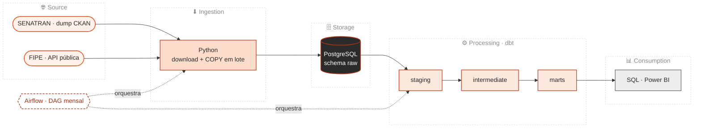

# Oi, eu sou o Alysson 👋

Engenheiro de Dados, em Curitiba

Hoje eu cuido da engenharia de dados ponta a ponta na empresa onde trabalho:
arquitetei o hub de dados do zero, levo o **SAP Business One** até as bases
analíticas que o comercial e o marketing usam, e sou a referência técnica da
squad, definindo a arquitetura, respondendo pelo merge e priorizando as demandas
com o negócio.

O que me interessa de verdade é dado que chega na hora certa e com o número
certo. É basicamente atrás disso que eu corro todo dia.

Algumas coisas que saíram disso:

- pipeline de faturamento **46% mais rápido** (140s para 76s)
- leitura das fontes SAP **3,9x mais rápida** e **47x menos memória**, com
  processamento incremental, Parquet particionado e PyArrow
- warehouse modelado em dbt (`staging → intermediate → marts`, marts em star
  schema, `dbt test` em todas as tabelas) e migrado para o **BigQuery**, hoje em
  produção com particionamento mensal e clustering dimensionados pelo custo por
  consulta
- **R$ 84 mil/ano** a menos, ao internalizar a entrega de uma consultoria
- **SLA de dado atualizado às 8h**, sustentado por pipelines idempotentes,
  monitoramento e alerta na falha

---

## Stack

| | |
|---|---|
| **Linguagens** | Python, SQL, PySpark |
| **Orquestração e transformação** | Apache Airflow, dbt Core |
| **Bancos e formatos** | BigQuery, PostgreSQL, MySQL, Parquet, PyArrow |
| **Cloud e infra** | GCP, Docker, GitHub Actions, Linux |
| **Também uso** | FastAPI, Power BI |

**Estudando agora:** PySpark, Terraform e arquiteturas distribuídas.

---

## Projetos

Três que valem a visita. A descrição de verdade está em cada repositório.

### [frota-brasil-pipeline](https://github.com/AlyssonCaputti/frota-brasil-pipeline)

Cruzei a frota circulante do SENATRAN com as specs da FIPE: 22M de linhas por
mês, 730M no histórico desde 2019, tudo de fonte aberta. A arquitetura é essa:

No repositório eu cobri `DAG mensal no Airflow` · `testes de granularidade e de
cobertura` · `backfill mês a mês sem estourar disco` · `CI que sobe Postgres e
roda o pipeline` · `limitações documentadas`.

### [sap-mysql-etl](https://github.com/AlyssonCaputti/sap-mysql-etl)

ETL que roda todo dia sobre uma origem que muda de formato sem avisar. Cobri
`contrato de schema` · `4 estratégias de carga idempotentes` · `reconciliação
transacional` · `falha alta, nunca silenciosa` · `suíte que roda em ~1s, sem
banco e sem rede`.

Tem uma história boa de bug lá dentro, que custou 33% da base e eu achei
investigando lentidão, não erro.

### [sql-agent](https://github.com/AlyssonCaputti/sql-agent)

Pergunta em português vira SQL via tool use da API da Anthropic, executa em modo
somente leitura e responde com base no resultado. Cobri `tool use` ·
`execução read-only` · `resposta ancorada no dado`.

Os outros ficam em
[todos os repositórios](https://github.com/AlyssonCaputti?tab=repositories),
incluindo o [cs-data-roadmap](https://github.com/AlyssonCaputti/cs-data-roadmap),
onde eu registro meu estudo.

---

**Bora conversar?**
[LinkedIn](https://www.linkedin.com/in/alyssoncaputti) ·
[alyssoncaputti@gmail.com](mailto:alyssoncaputti@gmail.com) ·
[LeetCode](https://leetcode.com/AlyssonCaputti)
